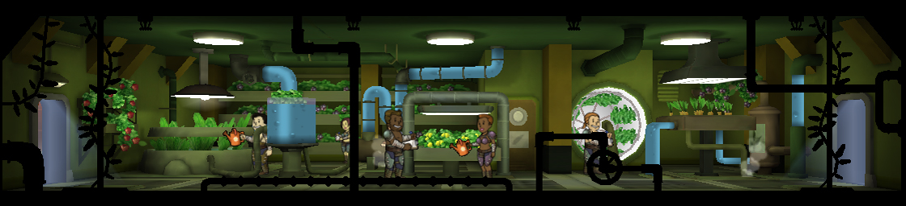
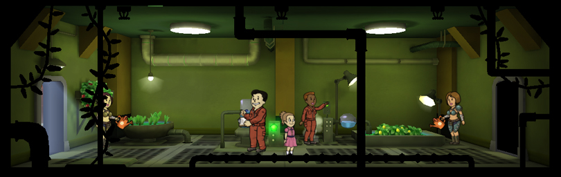
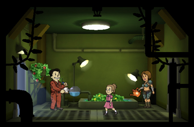

[Return](../index.html)

Garden
===========

## Triple Wide Room

Tier | Name | Cost | Upgrade Cost | Production | Storage | Destruction Value
------|------|------|------|------|------|------
1 | Garden | | 6000 | 33 | 150 | 720
2 | Greenhouse | | 18000 | 41 | 225 | 1200
3 | Hydroponics | | | 50 | 300 | 3600

## Double Wide Room

Tier | Name | Cost | Upgrade Cost | Production | Storage | Destruction Value
------|------|------|------|------|------|------
1 | Garden | | 4500 | 22 | 100 | 480
2 | Greenhouse | | xxx | 27 | 150 | xxx
3 | Hydroponics | | | xxx | xxx | xxx

## Single Wide Room

+300 each room

Tier | Name | Cost | Upgrade Cost | Production | Storage | Destruction Value
------|------|------|------|------|------|------
1 | Garden | 1200 | 3000 | 10 | 50 | 240
2 | Greenhouse | | xxx | 12 | 75 | xxx
3 | Hydroponics | | | xxx | xxx | xxx
