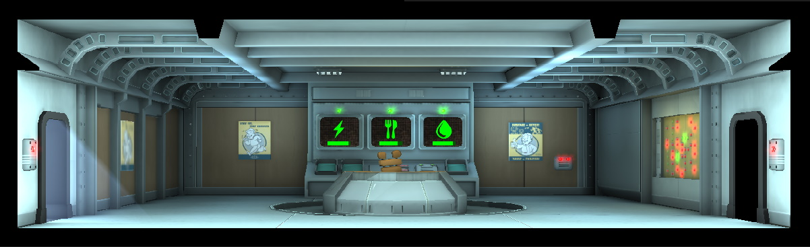

# Overseers Office

Tier | Name | Cost | Upgrade Cost | Destruction Value
------|------|------|------|------|------
1 | Overseers Office | 1000 | 3500 | 200
2 | | | | xxx
3 | | | | xxx

You can do one quest at tier one, two quests at tier two.

To Upgrade to tier 2 you will need 30 dwellers.
To Upgrade to tier 3 you will need 55 dwellers.
