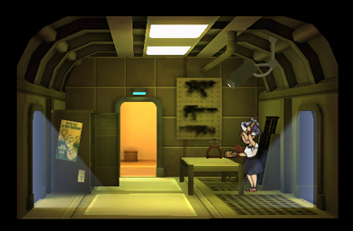

[Return](../README.md)

Armory
===========

## Triple Wide Room

## Double Wide Room

## Single Wide Room

Tier | Name | Cost | Upgrade Cost | Destruction Value
------|------|------|------|------|------
1 | Armory | 600 | 1500 | 120
2 | Weapons Station | | 4500 | 300
3 | Weapons Center | | | 900

### Teir 3 Training Times

Skill Value | Training Time
------|------
1 | 23m
2 | 1h 12m
4 | 4h 3m
5 | 5h 58m

### Teir 2 Training Times

Skill Value | Training Time
------|------
1 | 24m
2 | 1h 15m
3 | 2h 32m
4 | 4h 10m

### Teir 1 Training Times

Skill Value | Training Time
------|------
1 | 26m
2 | 1h 18m
3 | 2h 37m
4 | 4h 22m
5 | 6h 40m
