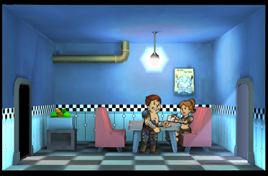

[Return](../README.md)

Diner
===========

## Triple Wide Room

Tier | Name | Cost | Upgrade Cost | Production | Storage | Destruction Value
------|------|------|------|------|------|------
1 | Diner | | 500 | 28 | 150 | 60
2 | Restaurant | | 1500 | 34 | 225 | 100
3 | Cafeteria | | | 40 | 300 | 300

## Double Wide Room

Tier | Name | Cost | Upgrade Cost | Production | Storage | Destruction Value
------|------|------|------|------|------|------
1 | Diner | | 375 | 18 | 100 | xxx
2 | Restaurant | | 1125 | 22 | 150 | xxx
3 | Cafeteria | | | 26 | 200 | xxx

## Single Wide Room

Each additional Room is 25 Caps

Tier | Name | Cost | Upgrade Cost | Production | Storage | Destruction Value
------|------|------|------|------|------|------
1 | Diner | 100 | 250 | 8 | 50 | xxx
2 | Restaurant | | 750 | 10 | 75 | xxx
3 | Cafeteria | | | 12 | 100 | xxx
