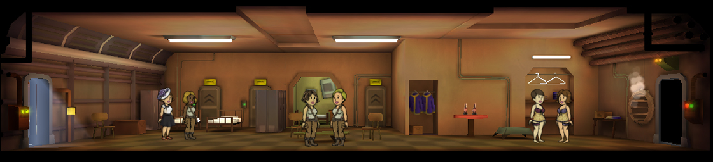
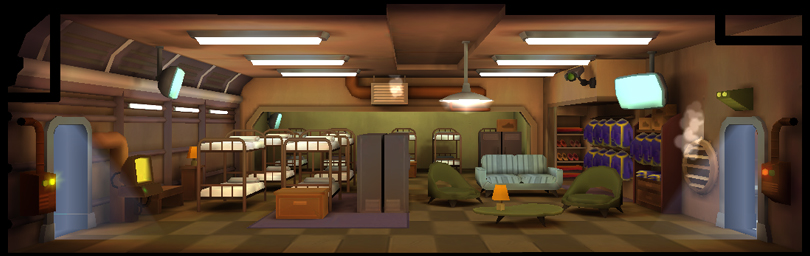

[Return](../README.md)

Living Quarters
===========

## Triple Wide Room

Tier | Name | Cost | Upgrade Cost | Living Spcae | Destruction Value
------|------|------|------|------|------|------
1 | Living Quarters | xxx | 500 | 28 | 60
2 | Residence | xxx | 1500 | 34 | 100
3 | Barracks | xxx | xxx | 40 | xxx

## Double Wide Room

Tier | Name | Cost | Upgrade Cost | Living Spcae | Destruction Value
------|------|------|------|------|------|------
1 | Living Quarters | xxx | 375 | 18 | 40
2 | Residence | xxx | 1125 | 22 | 75
3 | Barracks | xxx | xxx | 26 | 225

## Single Wide Room

[1] Cost is, (Number of Living Spaces X 10) +10

Tier | Name | Cost | Upgrade Cost | Living Spcae | Destruction Value
------|------|------|------|------|------|------
1 | Living Quarters | xxx | xxx | 8 | xxx
2 | Residence | xxx | xxx | 10 | xxx
3 | Barracks | xxx | xxx | 12 | xxx
