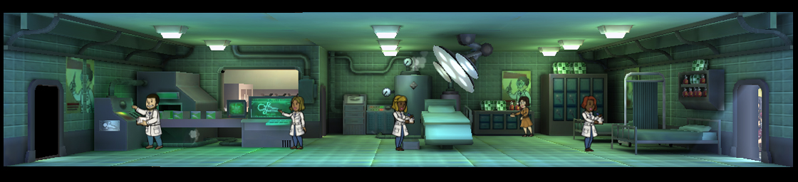
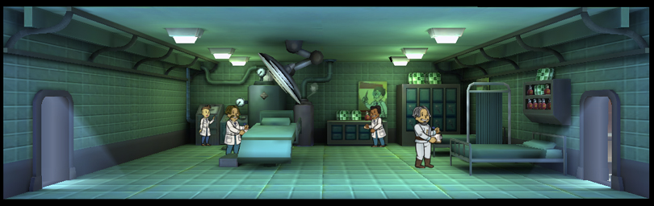

[Return](../README.md)

Medbay
===========

## Triple Wide Room

Tier | Name | Cost | Upgrade Cost | Stimpacks Produced | Storage | Destruction Value
------|------|------|------|------|------|------
1 | Medbay | | 2000 | 4 | 30 | xxx
2 | Clinic | | 6000 | 8 | 30 | 400
3 | Hospital | | | 12 | 30 | 1200

## Double Wide Room

Tier | Name | Cost | Upgrade Cost | Stimpacks Produced | Storage | Destruction Value
------|------|------|------|------|------|------
1 | Medbay | | 1500 | 3 | 20 | xxx
2 | Clinic | | 4500 | 6 | 20 | 300
3 | Hospital | | | 9 | 20 | xxx

## Single Wide Room

100 Additional Caps Per Room

Tier | Name | Cost | Upgrade Cost | Stimpacks Produced | Storage | Destruction Value
------|------|------|------|------|------|------
1 | Medbay | 400 | 1000 | 1 | 10 | 80
2 | Clinic | | 3000 | 2 | 10 | 200
3 | Hospital | | | 3 | 10 | xxx
