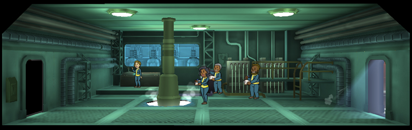
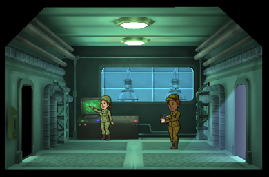

[Return](../README.md)

Power Generator
===========

## Triple Wide Room

Tier | Name | Cost | Upgrade Cost | Production | Storage | Destruction Value
------|------|------|------|------|------|------
1 | Power Generator | | 500 | 34 | 150 | 60
2 | Power Station | | 1500 | 40 | 225 | 100
3 | Power Plant | | | 49 | 300 | 300

## Double Wide Room

Tier | Name | Cost | Upgrade Cost | Production | Storage | Destruction Value
------|------|------|------|------|------|------
1 | Power Generator | | 375 | 22 | 100 | 40
2 | Power Station | | 1125 | 26 | 150 | 75
3 | Power Plant | | | 33 | 200 | 225

## Single Wide Room

[1] 25 Caps for each additional Room

Tier | Name | Cost | Upgrade Cost | Production | Storage | Destruction Value
------|------|------|------|------|------|------
1 | Power Generator | 100 [1] | 250 | 10 | 50 | 20
2 | Power Station | | 750 | 12 | 75 | 50
3 | Power Plant | | | 15 | 100 | xxx
