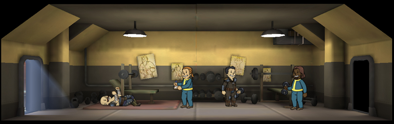

[Return](../index.html)

Weight Room
===========

## Triple Wide Room

Tier | Name | Cost | Upgrade Cost | Destruction Value
------|------|------|------|------|------
1 | Weight Room | | 3000 | 360
2 | Gym | | 9000 | 600
3 | Strength Center | | | xxx

## Double Wide Room

Tier | Name | Cost | Upgrade Cost | Destruction Value
------|------|------|------|------|------
1 | Weight Room | | 2250 | 240
2 | Gym | | 6750 | xxx
3 | Strength Center | | | 1350

## Single Wide Room

Tier | Name | Cost | Upgrade Cost | Destruction Value
------|------|------|------|------|------
1 | Weight Room | 600 | 1500 | 120
2 | Gym | | 4500 | 300
3 | Strength Center | | | 900

### Training Times

- Low happiness increases training times slightly.
- Having multiple Dwellers training in the same room decreases training times slightly.

Skill Value | Weight Room | Gym | Strength Center
------|------|------|------
1 | 26m | 24m | 23m
2 | 1h 18m | 1h 15m | 1h 12m
3 | 2h 37m | 2h 32m | 2h 16m
4 | 4h 22m | 3h 55m | 4h 3m
5 | 6h 40m | 5h 52m | 5h 58m
6 | 8h 35m | 8h 13m |
7 | 11h 28m | 10h 58m |
8 | 14h 44m | |
9 | 18h 25m | |
